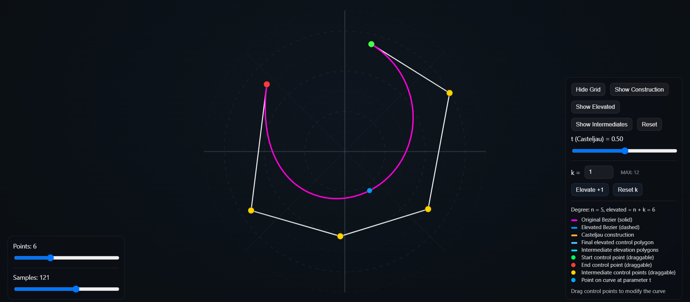
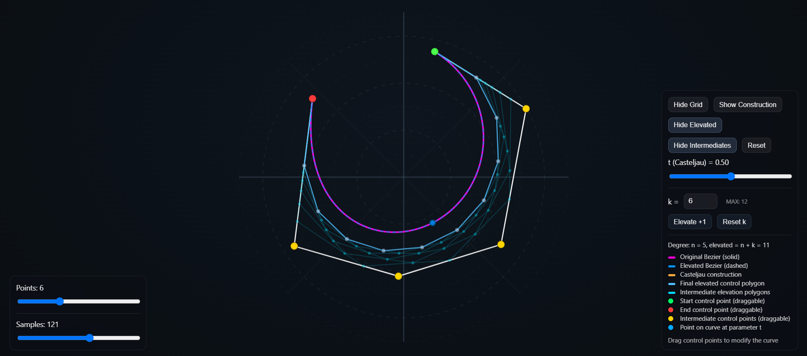

# DegreeElevation
Web-based interactive tool for visualizing Bézier curves, degree elevation, and the de Casteljau construction.

👉 [Live Demo](https://ivantrandzhiev.github.io/DegreeElevation/)

# Bézier Degree Elevation Visualizer

<p align="center">
  
</p>

<p align="center">
  <i>Original Bézier curve with control polygon.</i>
</p>

<p align="center">
  
</p>

<p align="center">
  <i>Degree-elevated Bézier representation with final and intermediate elevation polygons.</i>
</p>

**Bézier Degree Elevation Visualizer** is an interactive web-based tool for designing, exploring, and analyzing **Bézier curves**, **degree elevation**, and the **de Casteljau algorithm** in real time.

The project demonstrates how the degree of a Bézier curve can be increased without changing the actual shape of the curve. It also allows users to visualize the construction of a point on the curve using the de Casteljau algorithm and to observe the intermediate control polygons generated during multiple degree elevation steps.

This project was developed as part of the course
**Computer Geometric Modeling**
at the **Faculty of Mathematics and Informatics, Sofia University “St. Kliment Ohridski”** 🎓

It combines **computer graphics**, **computational geometry**, and **interactive visualization** into a small educational curve laboratory.

---

# 🎮 Controls (How to use)

| Action                                | Control                              |
| ------------------------------------- | ------------------------------------ |
| Move control point                    | Left mouse drag                      |
| Change number of control points       | Points slider                        |
| Change curve smoothness               | Samples slider                       |
| Change parameter `t`                  | `t` slider                           |
| Increase elevation level              | Elevate +1 button                    |
| Set elevation parameter `k`           | Number input                         |
| Reset elevation level                 | Reset k button                       |
| Reset curve                           | Reset button                         |
| Show / hide grid                      | Show Grid / Hide Grid button         |
| Show / hide elevated curve            | Show Elevated / Hide Elevated button |
| Show / hide de Casteljau construction | Show Construction button             |
| Show / hide intermediate polygons     | Show Intermediates button            |

---

# ✨ What this project is

This system behaves like a small interactive curve editor focused on **geometric understanding** rather than pure drawing.

It allows you to:

* create and modify Bézier curves using draggable control points;
* change the number of control points dynamically;
* visualize the original Bézier curve;
* visualize the original control polygon;
* elevate the degree of the curve by a selected value `k`;
* compare the original and elevated Bézier curves;
* observe that the curve shape remains unchanged after degree elevation;
* display the final elevated control polygon;
* display intermediate elevation polygons;
* evaluate points on the curve using the de Casteljau algorithm;
* visualize the full de Casteljau construction for a selected parameter `t`.

---

# 📐 Bézier curve definition

A Bézier curve is a parametric curve defined by a finite number of control points:

```
P0, P1, ..., Pn
```

where `n` is the degree of the curve.

The curve is defined as:

```
B(t) = Σ (from i = 0 to n) [ Bi,n(t) · Pi ],   t ∈ [0, 1]
```

where the Bernstein polynomials are:

```
Bi,n(t) = C(n, i) · (1 − t)^(n − i) · t^i
```

The first and last control points define the start and end of the curve. The remaining control points influence the shape of the curve through the control polygon.

---

# 🔁 de Casteljau algorithm

Instead of evaluating the Bézier polynomial directly, the project uses the **de Casteljau algorithm**.

The algorithm is based on repeated linear interpolation between neighboring control points.

Starting from the original control points:

```
Pi(0) = Pi
```

each next level is calculated as:

```
Pi(k)(t) = (1 − t) · Pi(k−1)(t) + t · P(i+1)(k−1)(t)
```

After `n` levels, only one point remains:

```
B(t) = P0(n)(t)
```

This point is the exact point on the Bézier curve for the selected parameter `t`.

In the application, the user can change `t` with a slider and observe how the point moves along the curve. When **Show Construction** is enabled, the intermediate interpolation levels are displayed visually.

---

# ⬆️ Degree Elevation

**Degree elevation** is an operation that increases the degree of a Bézier curve without changing its geometric shape.

If the original curve has degree `n`, after degree elevation it can be represented as a curve of degree `n + 1`.

The new control points are calculated as:

```
Q0 = P0

Qi = (i / (n + 1)) · P(i−1) + (1 − i / (n + 1)) · Pi

Q(n+1) = Pn
```

This creates a new control polygon with one additional control point.

The important idea is that the curve itself does not change. Only its representation changes.

That means:

* the original and elevated curves overlap;
* the number of control points increases;
* the control polygon changes;
* the geometric shape of the Bézier curve remains the same.

---

# 🔂 Multiple Degree Elevation

The project supports degree elevation by a parameter `k`.

If `k = 1`, the degree is increased once:

```
n → n + 1
```

If `k > 1`, the operation is applied repeatedly:

```
n → n + 1 → n + 2 → ... → n + k
```

Each step produces a new set of control points.

The final result is a Bézier curve of degree:

```
n + k
```

which represents the same original curve.

---

# 🔀 Intermediate Elevation Polygons

When the parameter `k` is greater than 1, the application can show the intermediate control polygons generated during the elevation process.

These polygons correspond to the degrees:

```
n + 1, n + 2, ..., n + k − 1
```

The final elevated control polygon corresponds to degree:

```
n + k
```

This visualization helps show that degree elevation is not a single visual change, but a sequence of geometric transformations applied step by step.

---

# 🧠 Interactive point management

The control points can be moved directly with the mouse.

When a control point is dragged:

1. its position is updated;
2. the original Bézier curve is recalculated;
3. the elevated control polygon is recalculated;
4. the elevated curve is redrawn;
5. the de Casteljau construction is updated if enabled;
6. the intermediate elevation polygons are updated if enabled.

This allows the user to explore the behavior of Bézier curves and degree elevation in real time.

---

# 🖥️ Rendering

The visualization is rendered using **HTML Canvas**.

The application draws:

* background grid;
* original control polygon;
* original Bézier curve;
* draggable control points;
* point on the curve for parameter `t`;
* de Casteljau construction lines and points;
* final elevated control polygon;
* elevated Bézier curve;
* intermediate elevation polygons.

The number of samples controls how smoothly the curve is drawn. A higher sample count produces a smoother curve, while a lower sample count makes the curve appear more segmented.

---

# 🛠️ Technologies Used

The project is built using standard web technologies:

* **HTML** – page structure and user interface;
* **CSS** – styling, layout, colors, panels and legend;
* **JavaScript** – application logic and mathematical calculations;
* **HTML Canvas** – rendering of curves, points, polygons and constructions.

No external libraries or frameworks are required.

---

# 📁 Project Structure

```text
.
├── index.html
├── styles.css
├── app.js
├── Degree_Elevation_Documentation.pdf
└── Images/
    ├── img1.png
    └── img2.png
```

## `index.html`

Contains the main structure of the web page, the canvas element and all interface controls.

## `styles.css`

Contains the visual styling of the application, including the HUD panels, buttons, sliders, legend and background.

## `app.js`

Contains the main logic of the application:

* canvas setup and resizing;
* control point generation;
* mouse interaction;
* de Casteljau algorithm;
* degree elevation calculations;
* drawing functions;
* UI event handling;
* real-time rendering.

## `Degree_Elevation_Documentation.pdf`

Contains the full project documentation, including mathematical explanation, implementation details, screenshots and user guide.

---

# 📚 Educational Purpose

The goal of this project is to help users understand:

* how Bézier curves are constructed;
* how control points affect the shape of a curve;
* how the de Casteljau algorithm works;
* how a point on the curve is calculated for a selected value of `t`;
* what degree elevation means;
* why degree elevation does not change the shape of the curve;
* how the control polygon changes after elevation;
* how intermediate elevation steps are formed.

---

# 👤 Author

Ivan Trandzhiev

Faculty of Mathematics and Informatics
Sofia University “St. Kliment Ohridski”

---

# 📄 License

This project is created for educational purposes.
